# UML Diagrams

This page contains all the UML diagrams for the project. Below you will find a variety of diagrams that represent the system's architecture, controllers, and services.

## Class Diagrams

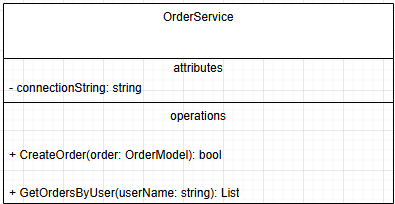
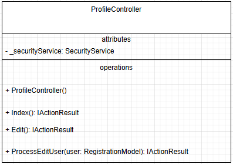
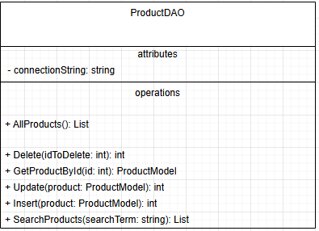
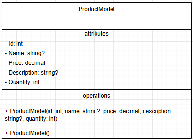
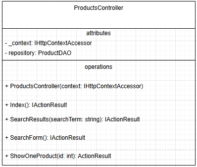
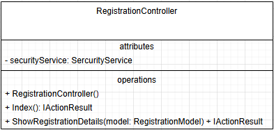
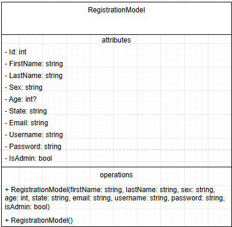
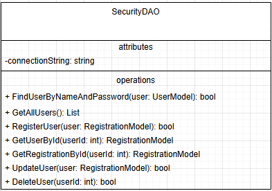
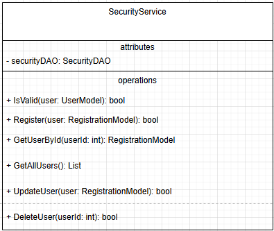
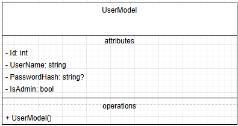
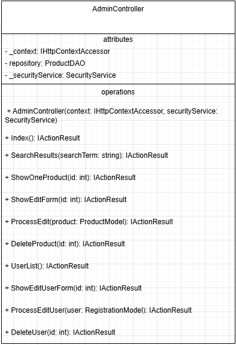
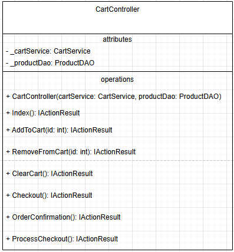
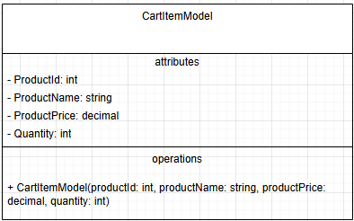
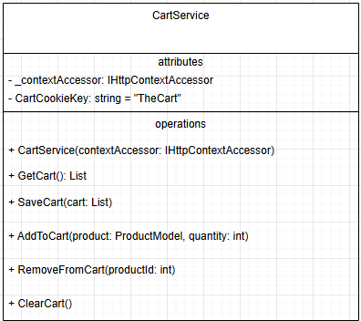
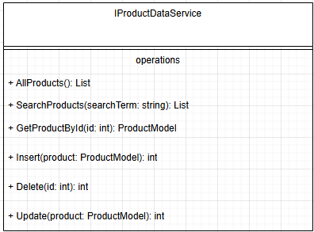
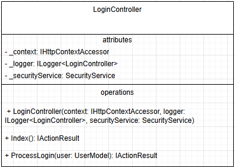
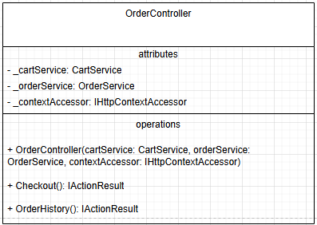
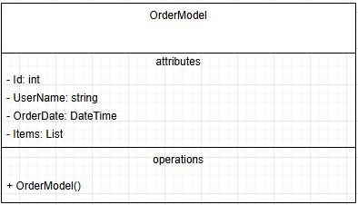

## UI Diagrams

